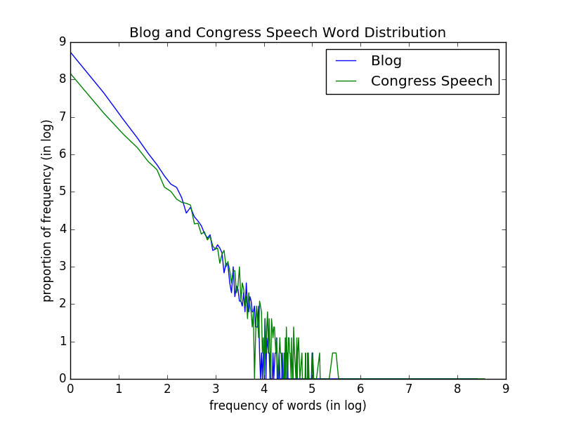

### SI650/EECS549 - Information Retrieval Assignment 1

##### 2017.01.29 PoHeng Chen (pohechen)

#### 1. Edit Distance
In the case that the step of **insert, delete, and substitute** is counted as 1 step, then the edit distance of "kitten" and "kitchen" is **2** and the edit distance of "familiar" and "similarity" is **6**.

#### 2. Vector Representation and Similarity

|    | computer | information | school | of | informatics | and | computing | science | institute |
| -- |:-:|:-:|:-:|:-:|:-:|:-:|:-:|:-:|:-:|
| q  | 1 | 1 | 0 | 0 | 0 | 0 | 0 | 0 | 0 |
| d1 | 0 | 1 | 1 | 1 | 0 | 0 | 0 | 0 | 0 |
| d2 | 0 | 0 | 1 | 1 | 1 | 1 | 1 | 0 | 0 |
| d3 | 0 | 1 | 0 | 0 | 0 | 0 | 0 | 1 | 1 |

- A. Each dimension represents a word which the query or documents have. 
- B. Both **d1** and **d3** are closer to q.
    + cosDist(q, d1) = 0.408; cosDist(q, d3) = 0.408; cosDist(q, d2) = 0.
- C. If we define stopwords are **of, and** which barely contain information and remove them, it will affect the ranking of the documents because the denominator of cosine similarity has the sum of vector. If the denominator has stopwords in it, the denominator will go larger. It is the case of **d1**, **d2**, and **d3**. 
    + cosDist(q, d1) = 0.5; cosDist(q, d3) = 0.408; cosDist(q, d2) = 0.
- D. Yes, if we normalize words, then **d2** which was totally indifferent to **q** now has strong similarity.
    + cosDist(q, d2) = 0.82; cosDist(q, d1) = 0.5; cosDist(q, d3) = 0.408. 
- E. The problem occurs when irrelevant words are meaningful but cannot be shown in vector. We can handle this by **penalizing irrelevant words**. We can give irrelevant words such as **school, institue** an extra weight. 
    + For example, if I give a constant weight of 3 to **school** word, then the cosine distance will be:
        * cosDist(q, d1) = 0.22; cosDist(q, d2) = 0.42; cosDist(q, d3) = 0.41.

#### 3. Probabilistic Reasoning and Bayes Rule
- A. The probability that a tweet is a spam given A = 1, L = 0, K = 0 is **0.0764**. The probability that a tweet is **NOT** a spam given same condition is **0.9236**.
    + *P(L = 0|S) = 0.9* and *P(K = 0|S) = 1.05* 
    + *P(S = 1|A = 1,L = 0,K = 0) = [P(A = 1,L = 0,K = 0|S = 1)\*P(S = 1)]/P(A = 1,L = 0,K = 0) = [P(A = 1|S = 1)\*P(L = 0|S = 1)\*P(K = 0|S = 1)\*P(S = 1)]/[P(A = 1)\*P(L = 0)\*P(K = 0)] = (0.95 \* 0.8 \* 0.95 \* 0.1)/(1 \* 0.9 \* 1.05) = __0.0764__* 
- B. We cannot change these probabilities freely and arbitrarily because of the **probability axioms**. We need to follow the axioms:
    + the probabilities must be between 0 and 1
    + the sum of the probabilities of an event must be 1, so if we arbitrarily change the 8 probabilities then we might not be able to satisfy this axiom.
- C. If we can only change one value, then we would change the prior *P(S)* value. The prior probability of spam is the key value that will significantly affect our conclusion since we base our calculation of using A, L, and K to infer S on the prior probability of spam. According to the Bayes' Law, we all eventually time the conditional probabilities with a prior probability.

#### 4. Word Distribution

 

**(1)** The plots look like a power-law distribution in logarithm. Their distributions are quite similar. 

**(2)** 

|    | blog | congress speech | note |
| -- |:-:|:-:|:-:|
| vocabulary size  | 12729 | 8461 | upper/lowercase ignored |
| stopword frequency | 46978 | 46050 | upper/lowercase ignored |
| # of capital letters | 32822 | 21909 | calculated capital letters such as 'A', 'B', 'C'...|
| ave # of chars per word | 4.307 | 4.789 | didn't ignore punctuations |
| # of nouns      | 35016 | 34141 |
| # of adjectives | 7085 | 8535 |
| # of verbs      | 15463 | 14843 |
| # of adverbs    | 4621 | 3426 |
| # of pronouns   | 5477 | 4313 |

  
    congress speech top 10:
    1. nouns: ['bill', 'program', 'year', 'security', 'legislation', 
               'percent', 'support', 'amendment', 'education', 'report']
    2. verbs: ['be', 'have', 'provide', 'ensure', 'make', 'support',
               'help', 'address', 'work', 'increase']
    3. adjectives: ['financial', 'other', 'many', 'such', 'public', 
                    'economic', 'important', 'new', 'first', 'military']
    blog top 10:
    1. nouns: ['time', 'war', 'way', 'government', 'president', 's', 'country', 'year', 'day', 'world']
        * as we can see, 's' wasn't removed before the analysis.
    2. verbs: ['be', 'have', 'Go', 'get', 'take', 'do', 'make', 'see', 'go', 'know']
    3. adjectives: ['new', 'other', 'American', 'presidential', 'first', 
                    'many', 'last', 'political', 'good', 'military']

**(3)** If we remove the punctuation, then:
    
    top 10 words in congress speech
        'AKAKA', 'FAS', 'agencies', 'animals', 'literacy', 
        'Medicaid', 'DSH', 'I', 'Homeland', 'diseases'
            * 'I' appears because I didn't make all words lowercase.
    top 10 words in blog
        's', 'Go', 'Israel', 'Iran', 'Top', 'Article', 'I', 'Is', 't', 'The'
            * we can see "'s" and "'t" show up because the tokenization process of nltk separates "don't" 
              into "don" and "t". If we want to make it better, we should try use regular expression to 
              take the cases of "don't" and "Obama's" into consideration. 
            * also the stopwords were not removed because some of them are uppercase. 

We can find the result of TF-IDF of congress speech is totally different from the result of top words in **(2)**. I think it is because TF-IDF use another way to quantify "importance" of words rather than only by frequency counts of words. Therefore, in TF-IDF of congress speech , we can see some acronyms such as AKAKA, FAS, and DSH appears. I googled them and found that [AKAKA](https://en.wikipedia.org/wiki/Daniel_Akaka) is a Democrat named Daniel Akaka. [FAS](https://www.fas.usda.gov/) might stand for Foreign Agricultural Service under United States Department of Agriculture. [DSH](https://www.dhs.gov/) stands for Department of Homeland Security.

On the other hand, the TF-IDF result of blog is not as distinctive as the one of congress speech. There are lots of noise since we didn't pay too much attention on cleaning the document. It is interesting that we can see the styles of used words between blog and congree speech are different. The selected words from blog are more casual and less acronyms. If we see the top 30 of TF-IDF words in blog, we can find more representative words such as Obama, Carter, Oscar, Hillary, Jewish, Israeli, Hamas and etc.

